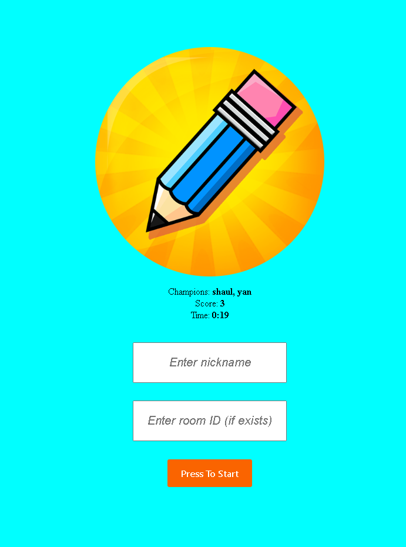

# Welcome to Sido's Draw and Guess

## Table of contents
* [General info](#general-info)
* [Contributing](#contributing)
* [Contact](#contact)

## General info

The Draw and Guess game is a drawing & guessing game for your phone, tablet or PC. 
Do your best to draw the word you are given while the second player tries to guess it!  
Enter your nickname and press the "Press To Start" button, a room ID will be displayed and now all that's left is to share the room ID with your friend ! 
You choose when to end the game by clicking the "End Game" button or just leaving, don't worry! a summary of your game will be displayed.  
Another feature the game has is every session stats is saved on the data base, the best session will be displayed on the home page

## Contributing

Contributions are what make the open source community such an amazing place to learn, inspire, and create. Any contributions you make are greatly appreciated.

1. Fork the Project
2. Create your Feature Branch
3. Commit your Changes
4. Push to the Branch
5. Open a Pull Request

## Contact

Github: [@Yan Sidorenko](https://github.com/YanSido)

Project Link: [Sido's Draw and Guess](https://github.com/YanSido/draw-and-guess)

Heroku: [https://sidodrawandguess.herokuapp.com/](https://sidodrawandguess.herokuapp.com/)